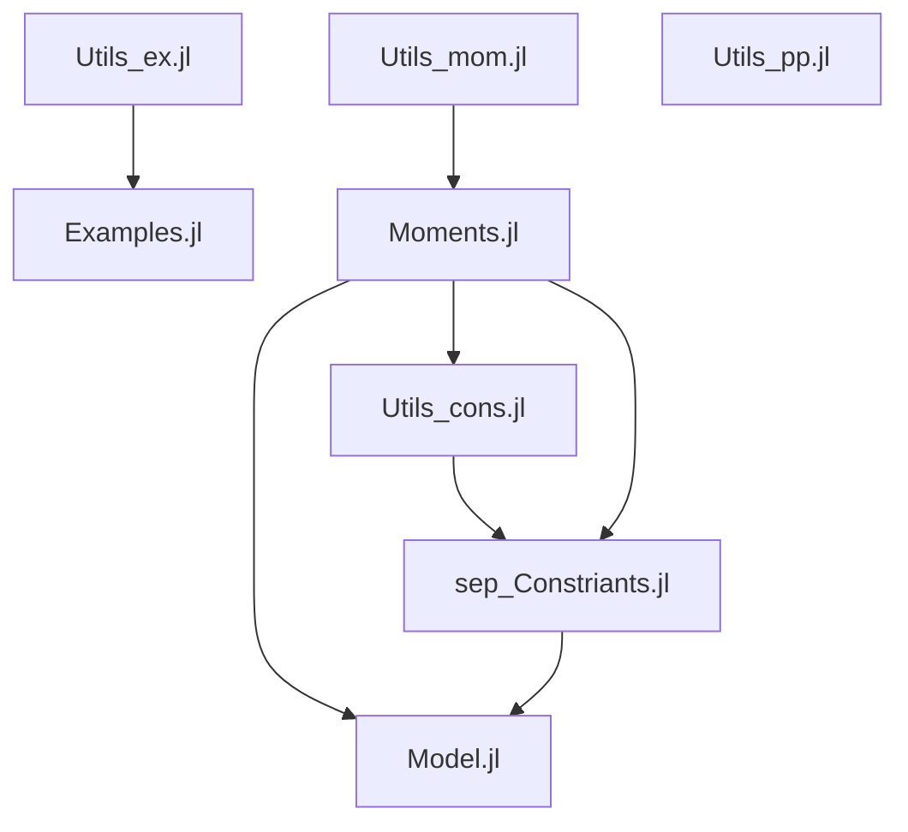
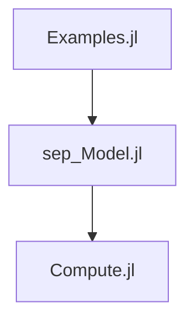

# ju-sep-rank
***Important note the code seems only to work in my global environment and not the local one. I have no idea why and will investigate further.***

##  File dependencies:



##  Workflow:



## Theory:
The goal is to compute a lower bound for the separable rank of a density matrix representing a quantum mechanical state.
#### Sources:
- 1. [Qubit-qudit states with positive partial transpose](http://arxiv.org/abs/1210.0111v2)
- 2. [Separability of Hermitian Tensors and PSD Decompositions](https://arxiv.org/abs/2011.08132v1)
- 3. [Separability of mixed states: necessary and sufficient conditions](https://arxiv.org/pdf/quant-ph/9605038v2.pdf)


## Real variant:
Assumption: 
```
ρ = ∑ʳaᵀa⊗bᵀb with a,b ∈ ℝᵈ
```

### Constraints
#### S₁
```
L ≥ 0 on M₂ₜ(S_ρ¹)
⟺
L(g⋅[x,y]ₜ₋₁[x,y]ₜ₋₁ᵀ) ⪰ 0 for
g = √(ρₘₐₓ) - xᵢ² , √(ρₘₐₓ) - yᵢ² and i ∈ [d]
```

#### S₂
```
L ≥ 0 on M₂ₜ(S_ρ²)
⟺
L(g⋅[x,y]ₜ₋₁[x,y]ₜ₋₁ᵀ) ⪰ 0 for
g = √(Tr(ρ)) - ∑xᵢ² , √(Tr(ρ)) - ∑yᵢ²
```

#### S₃
```
L ≥ 0 on M₂ₜ(S_ρ³)
⟺
L((Tr(ρ) - ∑xᵢ²)⋅[x,y]ₜ₋₁[x,y]ₜ₋₁ᵀ) ⪰ 0
L((sqrt(∑yᵢ²) - 1)⋅[x,y]ₜ₋₁[x,y]ₜ₋₁ᵀ) = 0
```

#### wG:
```
L((ρ - ([x,y]₌₁[x,y]₌₁ᵀ)) ⊗ ([x,y]₌ₗ[x,y]₌ₗᵀ)))for l ∈ 1,...,t-2.
= ρ⊗L([x,y]₌ₗ[x,y]₌ₗᵀ) - L(([x,y]₌₁[x,y]₌₁ᵀ)⊗([x,y]₌ₗ[x,y]₌ₗᵀ))
```
#### sG:
```
M(Gρ ⊗ L) ⪰ 0 constraints
Where: Gρ := ρ - xxᵀ⊗yyᵀ
M(Gρ ⊗ L) = L(Gρ ⊗ [x, y]ₜ₋₂[x, y]ᵀₜ₋₂) ⪰ 0
output: ρ⊗L([x, y]ₜ₋₂[x, y]ᵀₜ₋₂) - L( (xxᵀ⊗yyᵀ) ⊗ ([x, y]ₜ₋₂[x, y]ᵀₜ₋₂) )
```


## Complex variant:
We want to say things about 
```
x,x̄ ∈ ℂᵈ¹
y,ȳ ∈ ℂᵈ²

[x,x̄,y,ȳ]
xx̄ᵀ⊗yȳᵀ = xx*⊗yy*

||x||²
```
Let
```
x = uₓ + im vₓ ∈ ℂᵈ¹
 ̄x = uₓ - im vₓ ∈ ℂᵈ¹
y = uᵥ + im vᵥ ∈ ℂᵈ²
 ̄y = uᵥ - im vᵥ ∈ ℂᵈ²
```
with 
```
uₓ, vₓ ∈ ℝᵈ¹
uᵥ, vᵥ ∈ ℝᵈ²
```
 - `[x,x̄,y,ȳ]` now becomes `[uₓ,vₓ,uᵥ,vᵥ]` since these are real vectors and we can only work with reals.
 -`||x||² = ||uₓ||² + ||vₓ||² `
 - xx*⊗yy*  becomes:
```
    xx*⊗yy*  = (uₓ + im vₓ)(uₓ - im vₓ)ᵀ ⊗ (uᵥ + im vᵥ)(uᵥ - im vᵥ)ᵀ
             = ( (Uₓ +  Vₓ) + im (Wₓ - Wₓᵀ)) ⊗ ((Uᵥ +  Vᵥ) + im (Wᵥ - Wᵥᵀ))
    where:  Uₓ = uₓuₓᵀ , Vₓ = vₓvₓᵀ and Wₓ = vₓuₓᵀ
```	

So that if ρ = xx*⊗yy* we have
```	
real(ρ)  = (Uₓ + Vₓ)⊗(Uᵥ + Vᵥ) - (Wₓ - Wₓᵀ)⊗(Wᵥ - Wᵥᵀ)
     = Uₓ⊗Uᵥ + Uₓ⊗Vᵥ + Vₓ⊗Uᵥ + Vₓ⊗Vᵥ - (Wₓ⊗Wᵥ - Wₓ⊗Wᵥᵀ - Wₓᵀ⊗Wᵥ + Wₓᵀ⊗Wᵥᵀ)

imag(ρ)  = (Uₓ + Vₓ) ⊗ (Wᵥ - Wᵥᵀ) + (Wₓ - Wₓᵀ) ⊗ (Uᵥ +  Vᵥ)
     = Uₓ⊗Wᵥ - Uₓ⊗Wᵥᵀ + Vₓ⊗Wᵥ - Vₓ⊗Wᵥᵀ + (Wₓ⊗Uᵥ + Wₓ⊗Vᵥ - Wₓᵀ⊗Uᵥ - Wₓᵀ⊗Vᵥ)

```


### What becomes of the constraints?

#### S₁
```
L ≥ 0 on M₂ₜ(S_ρ¹)
⟺
L(g⋅[x,x̄,y,ȳ]ₜ₋₁[x,x̄,y,ȳ]ₜ₋₁ᵀ) ⪰ 0 for
g =
√(ρₘₐₓ) - xᵢx̄ᵢ , i ∈ [d₁] 
or
√(ρₘₐₓ) - yⱼȳⱼ , j ∈ [d₂]
⟺???
L(g⋅[uₓ,vₓ,uᵥ,vᵥ]ₜ₋₁[uₓ,vₓ,uᵥ,vᵥ]ₜ₋₁ᵀ) ⪰ 0 for
g =
√(ρₘₐₓ) - (uₓᵢ² + vₓᵢ²) , i ∈ [d₁] 
or
√(ρₘₐₓ) - (uᵥⱼ² + vᵥⱼ²) , j ∈ [d₂]
```

#### S₂
```
L ≥ 0 on M₂ₜ(S_ρ²)
⟺
L(g⋅[x,x̄,y,ȳ]ₜ₋₁[x,x̄,y,ȳ]ₜ₋₁ᵀ) ⪰ 0 for
g = 
√(Tr(ρ)) - ∑xᵢx̄ᵢ 
or
√(Tr(ρ)) - ∑yⱼȳⱼ
⟺???
L(g⋅[uₓ,vₓ,uᵥ,vᵥ]ₜ₋₁[uₓ,vₓ,uᵥ,vᵥ]ₜ₋₁ᵀ) ⪰ 0 for
g = 
√(Tr(ρ)) - ∑(uₓᵢ² + vₓᵢ²) 
or
√(Tr(ρ)) - ∑(uᵥⱼ² + vᵥⱼ²)
```

#### S₃
```
L ≥ 0 on M₂ₜ(S_ρ³)
⟺
L((Tr(ρ) - ∑xᵢx̄ᵢ)⋅[x,x̄,y,ȳ]ₜ₋₁[x,x̄,y,ȳ]ₜ₋₁ᵀ) ⪰ 0
L(∑yⱼȳⱼ - 1)⋅[x,x̄,y,ȳ]ₜ₋₁[x,x̄,y,ȳ]ₜ₋₁ᵀ) = 0
⟺
L((Tr(ρ) - ∑xᵢx̄ᵢ)⋅[uₓ,vₓ,uᵥ,vᵥ]ₜ₋₁[uₓ,vₓ,uᵥ,vᵥ]ₜ₋₁ᵀ) ⪰ 0
L(∑(uᵥⱼ² + vᵥⱼ²) - 1)⋅[uₓ,vₓ,uᵥ,vᵥ]ₜ₋₁[uₓ,vₓ,uᵥ,vᵥ]ₜ₋₁ᵀ) = 0
```

#### wG:
```
for l ∈ 1,...,t-2:
L((ρ - xx*⊗yy*) ⊗ ([x,x̄,y,ȳ]₌ₗ[x,x̄,y,ȳ]₌ₗ*)))
= ρ⊗L([x,x̄,y,ȳ]₌ₗ[x,x̄,y,ȳ]₌ₗ*) - L(xx*⊗yy*⊗([x,x̄,y,ȳ]₌ₗ[x,x̄,y,ȳ]₌ₗ*)) ⪰ 0
⟺
for l ∈ 1,...,t-2:
L( (real(ρ) - real(xx*⊗yy*)) ⊗ [uₓ,vₓ,uᵥ,vᵥ]ₜ₋₁[uₓ,vₓ,uᵥ,vᵥ]ₜ₋₁ᵀ) ⪰ 0
L( (imag(ρ) - imag(xx*⊗yy*)) ⊗ [uₓ,vₓ,uᵥ,vᵥ]ₜ₋₁[uₓ,vₓ,uᵥ,vᵥ]ₜ₋₁ᵀ) ⪰ 0
```
#### sG:
```
M(Gρ ⊗ L) ⪰ 0 constraints
Where: Gρ := ρ - xx*⊗yy*
M(Gρ ⊗ L) = L(Gρ ⊗ [x,x̄,y,ȳ]ₜ₋₂[x,x̄,y,ȳ]*ₜ₋₂) ⪰ 0
⟺
L( (real(ρ) - real(xx*⊗yy*)) ⊗ [uₓ,vₓ,uᵥ,vᵥ]ₜ₋₂[uₓ,vₓ,uᵥ,vᵥ]ₜ₋₂ᵀ) ⪰ 0
L( (imag(ρ) - imag(xx*⊗yy*)) ⊗ [uₓ,vₓ,uᵥ,vᵥ]ₜ₋₂[uₓ,vₓ,uᵥ,vᵥ]ₜ₋₂ᵀ) ⪰ 0

```


### Block diagonalization of the moment matrix:
As was proven in the paper we may assume that:


Which means that `([x,x̄,y,ȳ]₌ₗ[x,x̄,y,ȳ]₌ₗ*)` becomes block diagonal, i.e., ....


